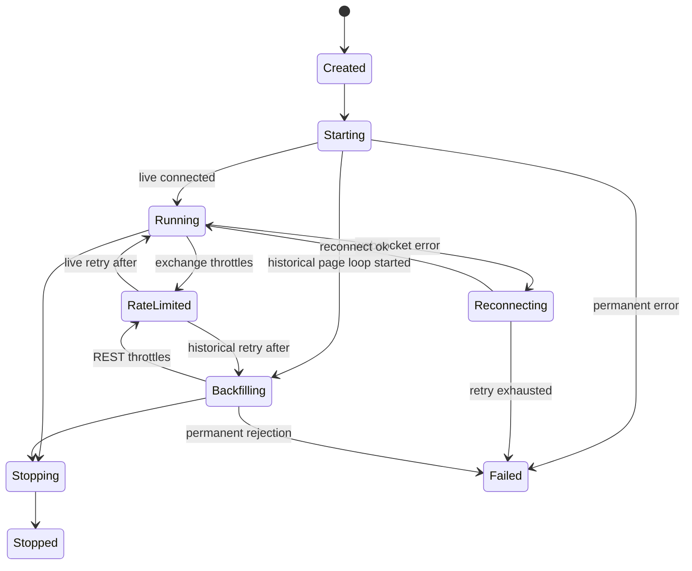

# fdc-barter Phase A 业务逻辑伪代码 Review

## 目的

本文是 `fdc-barter` Phase A 实现前的业务逻辑 review 输入。Phase A 只重构 `crates/fdc-adapter/barter` 内部模块和核心模型，不连接真实交易所网络，不修改 `fdc-ingestion`，不实现历史 REST 客户端。

相关实施计划：`docs/superpowers/plans/2026-05-18-fdc-barter-phase-a-module-refactor.md`。

## Phase A 成功标准

- `fdc-barter` 从单文件骨架拆成按业务边界组织的模块。
- 实时 Barter `MarketEvent` 可以转换为 mdb adapter event。
- trade amount 保留小数精度，不再落到 `Volume(u64)`。
- 历史请求、cursor、checkpoint 可以表达分页恢复语义。
- ingestion envelope 可以携带 event、checkpoint 和质量标记。
- source 状态可以表达 live、historical、reconnect、rate limit、failure。
- capability 可以声明交易所支持的数据类型和限流规则。
- 单元测试不访问真实网络。

## 业务边界

```text
barter-data MarketEvent
        ↓
mapper::{exchange,instrument,event}
        ↓
model::event::BarterMarketEvent
        ↓
ingestion::envelope::BarterIngestionEnvelope
        ↓
future fdc-ingestion source path
```

Phase A 不创建下面这些运行时组件：

```text
DynamicStreams::init
REST historical client
fdc-ingestion source buffer
fdc-transform mapping pipeline
storage writer
```

## 核心数据模型草图

### 1. 市场数据类型

```rust
enum BarterMarketDataKind {
    Trade,
    OrderBookL1,
    OrderBook,
    Candle,
    Liquidation,
}
```

业务语义：

- `Trade` 表示逐笔成交。
- `OrderBookL1` 表示最优买卖价。
- `OrderBook` 表示完整或增量 order book，Phase A 只保留 payload 边界。
- `Candle` 表示 K 线，后续历史 REST 优先支持。
- `Liquidation` 表示强平事件，Phase A 只保留 payload 边界。

### 2. 获取模式

```rust
enum BarterMarketDataMode {
    Live,
    Historical { start: TimestampNs, end: Option<TimestampNs> },
}
```

业务语义：

- `Live` 事件来自实时 WebSocket。
- `Historical` 事件来自历史分页或 replay。
- 同一 `BarterMarketEvent` 结构同时承载实时和历史数据，避免下游分叉。

### 3. payload 模型

```rust
type DecimalQuantity = rust_decimal::Decimal;

struct TradePayload {
    trade_id: Option<String>,
    price: Price,
    quantity: DecimalQuantity,
    side: Option<TradeSide>,
}

enum TradeSide {
    Buy,
    Sell,
}

struct OrderBookL1Payload {
    bid_price: Option<Price>,
    bid_quantity: Option<DecimalQuantity>,
    ask_price: Option<Price>,
    ask_quantity: Option<DecimalQuantity>,
}

struct CandlePayload {
    open_time: TimestampNs,
    close_time: TimestampNs,
    open: Price,
    high: Price,
    low: Price,
    close: Price,
    volume: DecimalQuantity,
}

enum BarterMarketPayload {
    Trade(TradePayload),
    OrderBookL1(OrderBookL1Payload),
    OrderBookDelta(RawPayload),
    Candle(CandlePayload),
    Liquidation(RawPayload),
    Raw(RawPayload),
}
```

业务规则：

- crypto 成交量和挂单量必须保留小数，不允许截断成整数。
- Phase A 对未完整建模的数据类型可以放入 `RawPayload`，但 event kind 仍需正确。
- 后续 `fdc-transform` 决定如何将 decimal amount 映射到目标 schema。

### 4. adapter event

```rust
struct BarterMarketEvent {
    source: String,
    mode: BarterMarketDataMode,
    exchange: String,
    symbol: Symbol,
    kind: BarterMarketDataKind,
    timestamp: TimestampNs,
    received_at: TimestampNs,
    payload: BarterMarketPayload,
    sequence: Option<String>,
    checkpoint: Option<BarterCheckpoint>,
}
```

业务规则：

- `source` 默认是 `barter-rs`，后续 source runtime 可覆盖为具体 source id。
- `exchange` 使用 snake_case，例如 `binance_spot`。
- `symbol` 使用 mdb 标准 symbol，例如 `BTCUSDT`。
- `timestamp` 是交易所事件时间。
- `received_at` 是 adapter 收到事件的时间。
- `checkpoint` 主要用于 historical/backfill event，也允许 live replay 时携带。

## 实时事件映射伪代码

```rust
fn map_market_event(event: MarketEvent<MarketDataInstrument, DataKind>) -> Result<BarterMarketEvent> {
    let exchange = map_exchange(event.exchange);
    let symbol = map_instrument(event.instrument);
    let timestamp = timestamp_from_chrono(event.time_exchange)?;
    let received_at = timestamp_from_chrono(event.time_received)?;

    let payload = match event.kind {
        DataKind::Trade(trade) => BarterMarketPayload::Trade(map_trade_payload(trade)?),
        DataKind::OrderBookL1(book) => BarterMarketPayload::OrderBookL1(map_l1_payload(book)?),
        DataKind::OrderBook(book) => BarterMarketPayload::OrderBookDelta(map_raw_order_book(book)?),
        DataKind::Candle(candle) => BarterMarketPayload::Candle(map_candle_payload(candle)?),
        DataKind::Liquidation(liquidation) => BarterMarketPayload::Liquidation(map_raw_liquidation(liquidation)?),
    };

    Ok(BarterMarketEvent {
        source: "barter-rs".to_string(),
        mode: BarterMarketDataMode::Live,
        exchange,
        symbol,
        kind: payload.kind(),
        timestamp,
        received_at,
        payload,
        sequence: None,
        checkpoint: None,
    })
}
```

### trade payload 映射

```rust
fn map_trade_payload(trade: PublicTrade) -> Result<TradePayload> {
    Ok(TradePayload {
        trade_id: Some(trade.id),
        price: Price::from_f64(trade.price)
            .ok_or(BarterAdapterError::InvalidNumericValue { field: "price", value: trade.price })?,
        quantity: Decimal::from_f64_retain(trade.amount)
            .ok_or(BarterAdapterError::InvalidNumericValue { field: "amount", value: trade.amount })?,
        side: Some(match trade.side {
            Side::Buy => TradeSide::Buy,
            Side::Sell => TradeSide::Sell,
        }),
    })
}
```

Review 要点：`2.5` 必须保持为 `Decimal("2.5")`，不能变成 `Volume(2)`。

## 请求模型伪代码

### 实时请求

```rust
struct BarterMarketDataRequest {
    source_id: String,
    exchange: String,
    symbols: Vec<String>,
    kinds: Vec<BarterMarketDataKind>,
    mode: BarterMarketDataMode,
}

impl BarterMarketDataRequest {
    fn live(exchange: impl Into<String>, symbols: Vec<&str>, kinds: Vec<BarterMarketDataKind>) -> Self {
        let exchange = exchange.into();
        Self {
            source_id: format!("barter-{exchange}-live"),
            exchange,
            symbols: symbols.into_iter().map(str::to_string).collect(),
            kinds,
            mode: BarterMarketDataMode::Live,
        }
    }
}
```

### 历史分页请求

```rust
struct HistoricalPageRequest {
    source_id: String,
    exchange: String,
    symbol: String,
    kind: BarterMarketDataKind,
    start: TimestampNs,
    end: Option<TimestampNs>,
    limit: Option<usize>,
    cursor: Option<HistoricalCursor>,
}
```

业务规则：

- 每个 historical request 只描述一个 `exchange + symbol + kind` 分页单元。
- `limit` 表示单页最大记录数或交易所 endpoint limit。
- `cursor` 用于恢复下一页，不要求所有交易所都支持 page token。

## 历史 cursor 和 checkpoint 伪代码

```rust
struct HistoricalCursor {
    exchange: String,
    symbol: String,
    kind: BarterMarketDataKind,
    next_start: Option<TimestampNs>,
    page_token: Option<String>,
    last_seen_exchange_id: Option<String>,
}

struct BarterCheckpoint {
    source_id: String,
    exchange: String,
    symbol: String,
    kind: BarterMarketDataKind,
    mode: BarterMarketDataMode,
    last_event_time: TimestampNs,
    cursor: Option<HistoricalCursor>,
    updated_at: TimestampNs,
}
```

### checkpoint 更新流程

```rust
fn checkpoint_from_historical_page(
    request: &HistoricalPageRequest,
    last_event_time: TimestampNs,
    next_cursor: HistoricalCursor,
) -> BarterCheckpoint {
    BarterCheckpoint {
        source_id: request.source_id.clone(),
        exchange: request.exchange.clone(),
        symbol: request.symbol.clone(),
        kind: request.kind,
        mode: BarterMarketDataMode::Historical { start: request.start, end: request.end },
        last_event_time,
        cursor: Some(next_cursor),
        updated_at: TimestampNs::now(),
    }
}
```

### 历史分页业务流程

```text
1. source runtime receives HistoricalPageRequest.
2. runtime loads request.cursor if resume exists.
3. runtime fetches one page from exchange REST client. Not implemented in Phase A.
4. runtime maps each remote item into BarterMarketEvent { mode: Historical, checkpoint: None }.
5. runtime computes next HistoricalCursor from exchange response.
6. runtime creates BarterCheckpoint from last emitted event time and next cursor.
7. runtime attaches checkpoint to last event or emits checkpoint through envelope metadata.
8. ingestion stores envelope and checkpoint for resume.
```

Phase A 只实现第 4 到第 7 步所需的数据结构和构造函数，不实现第 3 步。

## ingestion envelope 伪代码

```rust
struct DataQualityFlags {
    is_replay: bool,
    is_backfill: bool,
    is_duplicate_candidate: bool,
    has_gap_before: bool,
    is_out_of_order: bool,
}

struct BarterIngestionEnvelope {
    envelope_id: String,
    source_id: String,
    emitted_at: TimestampNs,
    event: BarterMarketEvent,
    checkpoint: Option<BarterCheckpoint>,
    quality: DataQualityFlags,
}

impl BarterIngestionEnvelope {
    fn from_event(source_id: impl Into<String>, event: BarterMarketEvent) -> Self {
        Self {
            envelope_id: Uuid::new_v4().to_string(),
            source_id: source_id.into(),
            emitted_at: TimestampNs::now(),
            checkpoint: event.checkpoint.clone(),
            quality: DataQualityFlags::default(),
            event,
        }
    }
}
```

业务规则：

- `envelope_id` 是下游 dedupe 和 trace 的 envelope 级 id。
- `source_id` 是 ingestion source 级 id，不一定等于 adapter 名称。
- `quality.is_backfill = true` 用于 historical/backfill 数据。
- `quality.is_duplicate_candidate = true` 用于 live/historical 衔接窗口重叠的数据。
- Phase A 默认 flags 全部为 `false`，只保证字段存在。

## source 状态机伪代码

```rust
enum BarterSourceStatus {
    Created,
    Starting,
    Running,
    Backfilling,
    Reconnecting,
    RateLimited,
    Stopping,
    Stopped,
    Failed,
}

struct BarterSourceState {
    source_id: String,
    mode: BarterMarketDataMode,
    status: BarterSourceStatus,
    started_at: Option<TimestampNs>,
    last_event_at: Option<TimestampNs>,
    last_error: Option<String>,
    checkpoint: Option<BarterCheckpoint>,
}
```

### 状态转移 review 图



Phase A 只实现 enum 和 state struct，不实现异步 runtime。

## capability 和限流伪代码

```rust
struct RateLimitRule {
    exchange: String,
    endpoint: String,
    max_requests: u32,
    window_ms: u64,
    weight: u32,
}

struct BarterSourceCapabilities {
    exchange: String,
    supports_live: bool,
    supports_historical: bool,
    kinds: Vec<BarterMarketDataKind>,
    historical_kinds: Vec<BarterMarketDataKind>,
    rate_limits: Vec<RateLimitRule>,
}
```

业务规则：

- `kinds` 表示 live 支持的数据类型。
- `historical_kinds` 表示 historical REST 支持的数据类型。
- 如果 `historical_kinds` 非空，则 `supports_historical = true`。
- `rate_limits` 是 Phase B/C 实现 REST client 前的契约输入。

## Review 关注点

1. 是否同意 Phase A 只做类型、mapper、envelope 和 capability，不接网络？
2. 是否同意 `BarterMarketEvent` 从 `price/volume` 改为 `payload`？
3. 是否同意 trade quantity 使用 `rust_decimal::Decimal` 保留 crypto 小数？
4. 是否同意 historical cursor 同时支持 `next_start`、`page_token`、`last_seen_exchange_id`，以兼容不同交易所？
5. 是否同意 `fdc-ingestion` 在 Phase A 不改动，只通过 envelope 契约预留 source path？

## Phase A 实现任务映射

| Review 内容 | 实施计划任务 |
| --- | --- |
| 模块边界和 re-export | Task 1 |
| payload 和 decimal quantity | Task 2 |
| historical request/cursor/checkpoint | Task 3 |
| ingestion envelope/quality flags | Task 4 |
| source state/capability/rate limit | Task 5 |
| 无网络和测试验证 | Task 6 |
