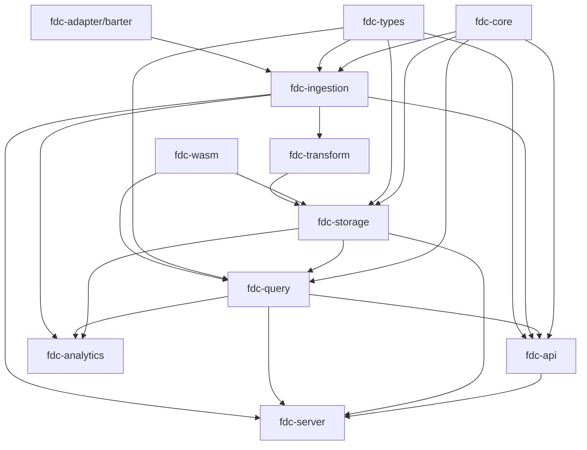

# MDB 项目架构总览

## 文档状态

- 状态：初版，基于当前代码结构整理，后续随实现持续维护
- 适用范围：workspace 顶层模块职责、服务启动边界、主要模块交互关系
- 关联模块：`crates/*`
- 备注：本文不替代已有专项设计文档，Barter 和 source ingestion 细节仍以 `docs/architecture/market-data-source-design.md` 等文档为准。

## 项目定位

`mdb` 是一个 Rust Cargo workspace，目标是构建面向金融行情、高频数据、查询、存储、WASM 插件和分析计算的 Financial Data Center。

当前项目采用多 crate 分层方式组织：

```text
外部数据源 / 交易所 / Barter
        ↓
fdc-adapter/barter
        ↓
fdc-ingestion
        ↓
fdc-storage
        ↑
fdc-query
        ↑
fdc-api
        ↑
REST / gRPC / GraphQL / WebSocket 客户端

旁路能力：
fdc-core      全局基础类型、错误、配置、指标
fdc-types     自定义类型、金融类型、类型校验
fdc-wasm      插件、沙箱、动态扩展
fdc-analytics 分析、指标、风控、机器学习
fdc-transform 数据转换，已具备市场数据 DTO 和 transform sink 边界
```

## Workspace 模块概览

根目录 `Cargo.toml` 中当前 workspace 成员包括：

| 模块 | 目录 | 职责摘要 | 当前状态 |
| --- | --- | --- | --- |
| `fdc-core` | `crates/fdc-core` | 核心类型、错误、配置、指标、时间、内存、WASM 桥接基础 | 已有基础实现 |
| `fdc-storage` | `crates/fdc-storage` | 多引擎存储、层级、分片、索引、缓存、压缩、备份、复制 | 已有抽象和模块骨架 |
| `fdc-query` | `crates/fdc-query` | SQL 解析、优化、计划、执行、缓存、查询指标 | 查询链路设计较完整 |
| `fdc-ingestion` | `crates/fdc-ingestion` | 数据接收、解析、校验、缓冲、批处理、背压、恢复、source path | source path 持续完善中 |
| `fdc-api` | `crates/fdc-api` | REST、gRPC、GraphQL、WebSocket、认证、中间件、API server | Axum server 可作为启动基础 |
| `fdc-analytics` | `crates/fdc-analytics` | 流处理、批处理、机器学习、风控、技术指标、窗口计算 | 模块骨架存在 |
| `fdc-wasm` | `crates/fdc-wasm` | WASM 运行时、插件、注册表、沙箱、桥接、事件、指标 | 模块骨架存在 |
| `fdc-types` | `crates/fdc-types` | 类型注册、定义、校验、转换、schema、金融类型、WASM 类型集成 | 模块骨架存在 |
| `fdc-transform` | `crates/fdc-transform` | 数据清洗、字段映射、格式转换、类型转换 | 已有市场数据 DTO 和 transform sink 边界 |
| `fdc-adapter/barter` | `crates/fdc-adapter/barter` | Barter 行情源适配、模型、映射、capability、ingestion envelope | 边界清晰，已有测试 |
| `fdc-common` | `crates/fdc-common` | 公共工具或共享能力 | 当前较轻量 |
| `fdc-proto` | `crates/fdc-proto` | Protobuf/gRPC 协议模型 | 待进一步集成 |
| `fdc-cli` | `crates/fdc-cli` | 命令行入口 | 当前仍是模板 |
| `fdc-server` | `crates/fdc-server` | 应用装配和服务启动入口 | 当前仍是模板 |

## 服务启动模块

### 当前实际状态

理论上统一服务启动入口应位于：

```text
crates/fdc-server
```

但当前 `fdc-server` 还没有真正的 `main.rs`，`src/lib.rs` 仍是 Cargo 默认示例函数。因此当前项目还没有完整的统一服务启动入口。

当前最接近服务启动逻辑的是：

```text
crates/fdc-api/src/server.rs
```

其中 `ApiServer` 负责：

```rust
pub struct ApiServer {
    config: Arc<ApiConfig>,
    router: Option<Router>,
}
```

主要启动流程：

```text
ApiConfig::default()
        ↓
ApiServer::new(config)
        ↓
build_router()
        ↓
TcpListener::bind(host:rest_port)
        ↓
axum::serve(listener, router)
```

默认 REST 配置来自 `crates/fdc-api/src/config.rs`：

```text
host: 0.0.0.0
REST port: 8080
gRPC port: 9090
GraphQL endpoint: /graphql
WebSocket endpoint: /ws
```

当前 `ApiServer` 暴露的 HTTP 路由包括：

```text
GET  /health
GET  /ready
GET  /version
POST /query
POST /insert
GET  metrics endpoint
```

注意：当前 `/query` 和 `/insert` 仍是模拟实现，还没有真正接入 `fdc-query`、`fdc-ingestion`、`fdc-storage`。

### 建议的正式启动职责

后续建议将 `fdc-server` 定位为应用装配层，负责：

1. 加载全局配置。
2. 初始化日志和 metrics。
3. 初始化类型系统和 WASM 插件系统。
4. 初始化 `StorageEngine`。
5. 初始化 `QueryEngine`。
6. 初始化 ingestion pipeline。
7. 初始化 analytics，可选。
8. 构建 API `AppState`。
9. 启动 REST/gRPC/WebSocket/GraphQL 服务。
10. 统一处理 shutdown signal 和优雅关闭。

建议启动顺序：

```text
tracing / config
        ↓
TypeRegistry / WasmRuntime
        ↓
StorageEngine.initialize()
        ↓
QueryEngine::new(storage)
        ↓
Ingestion pipeline
        ↓
ApiServer with AppState
        ↓
axum / tonic / websocket serve
        ↓
graceful shutdown
```

## 模块职责说明

### fdc-core

`fdc-core` 是基础层，导出：

```text
types
config
error
metrics
time
memory
wasm_bridge
type_registry
```

职责：

- 定义核心数据类型。
- 提供统一 `Error` / `Result`。
- 提供基础配置、指标、时间和内存管理能力。
- 提供 WASM 桥接和类型注册基础能力。

该模块被存储、查询、接入、API 等多个模块依赖。

### fdc-storage

`fdc-storage` 是持久化层，导出：

```text
engine
tier
shard
index
cache
compression
replication
backup
metrics
config
engines/memory
engines/redb
engines/duckdb
engines/rocksdb
```

核心抽象是 `StorageEngine` trait，提供初始化、关闭、`get`、`put`、`delete`、`batch`、`scan` 等能力。

存储层的目标是支持多层存储：

```text
L1 Memory
L2 Redb
L3 DuckDB
L4 RocksDB
```

主要上游使用方：

- `fdc-query`：查询执行读取数据。
- `fdc-ingestion`：理论上应写入数据，但当前部分路径仍使用简化存储接口。
- `fdc-analytics`：后续读取历史数据或写入分析结果。

### fdc-query

`fdc-query` 是查询引擎，导出：

```text
parser
optimizer
executor
planner
cache
engine
functions
aggregates
joins
filters
projections
sorts
metrics
config
```

查询执行链路：

```text
execute_sql(sql)
        ↓
创建 ExecutionContext
        ↓
检查 QueryCache
        ↓
SqlParser.parse(sql)
        ↓
QueryOptimizer.optimize(parsed_query)
        ↓
QueryPlanner.create_plan(optimized_plan)
        ↓
DefaultQueryExecutor.execute(...)
        ↓
StorageEngine 读取数据
        ↓
写入缓存和 metrics
        ↓
ExecutionResult
```

`QueryEngine::new` 需要注入 `Arc<dyn StorageEngine>`，说明查询模块通过存储抽象访问底层数据。

### fdc-ingestion

`fdc-ingestion` 是数据接入层，导出：

```text
receiver
parser
validator
buffer
batch
backpressure
recovery
metrics
config
protocols
source
```

传统字节流路径：

```text
ReceivedData
        ↓
DataParser
        ↓
DataValidator
        ↓
DataBuffer
        ↓
BatchProcessor
        ↓
Storage
```

新的 structured source path：

```text
SourceEnvelope<T>
        ↓
SourceValidator
        ↓
SourceBatchItem
        ↓
SourceBatchProcessor
        ↓
SourcePipelineResult
```

`run_source_pipeline_once` 当前体现了 source path 的一次性管道流程：校验 envelope，组装 batch item，触发批处理，最后 flush。

当前需要注意：普通 `BatchProcessor` 仍使用 `SimpleStorage`，`fdc-ingestion` 的 `Cargo.toml` 中对 `fdc-storage` 依赖暂时注释，说明接入层和正式存储层还未完全打通。

### fdc-api

`fdc-api` 是对外接口层，导出：

```text
rest
grpc
graphql
websocket
auth
middleware
config
server
handlers
models
errors
metrics
```

当前能力：

- `server.rs` 中已有 Axum HTTP server。
- `rest.rs` 有基础 router 模板。
- `grpc.rs` 有 gRPC server 模板。
- `handlers.rs` 有 `QueryHandler` 和 `InsertHandler`，但仍是简化实现。

目标交互应该是：

```text
/query → QueryEngine
/insert → Ingestion pipeline 或 Storage write path
/ws → 实时订阅、行情推送或 query stream
/grpc → 高性能内部/外部协议访问
/graphql → 灵活查询入口
```

建议后续引入共享状态：

```rust
pub struct AppState {
    pub storage: Arc<dyn StorageEngine>,
    pub query_engine: Arc<QueryEngine>,
    pub ingestion: Arc<IngestionService>,
}
```

然后通过 Axum state 将真实业务模块注入 handler。

### fdc-adapter/barter

`fdc-adapter/barter` 是 Barter-rs 行情源适配器，导出：

```text
capability
config
error
ingestion
mapper
model
```

职责边界：

- 对接 Barter exchange market data streams。
- 定义 Barter 行情事件模型。
- 维护 source state、checkpoint、request 等模型。
- 将 Barter event 映射为内部 market event。
- 生成 `BarterIngestionEnvelope` 交给 ingestion。

该模块刻意不处理：

- storage
- query
- trading execution

典型链路：

```text
Barter Market Stream
        ↓
BarterMarketEvent
        ↓
mapper::event::map_market_event
        ↓
BarterIngestionEnvelope
        ↓
fdc-ingestion source pipeline
```

### fdc-analytics

`fdc-analytics` 是分析计算层，导出：

```text
stream
batch
ml
risk
indicators
aggregation
windowing
pipeline
config
metrics
models
```

职责：

- 流处理。
- 批处理。
- 机器学习。
- 风险计算。
- 技术指标。
- 聚合和时间窗口计算。

预期数据来源：

```text
fdc-ingestion 实时数据
fdc-storage 历史数据
fdc-query 查询结果
```

当前尚未与 `fdc-server` 或 `fdc-api` 形成完整运行闭环。

### fdc-wasm

`fdc-wasm` 是插件扩展层，导出：

```text
runtime
plugin
registry
security
loader
bridge
types
events
metrics
```

使用场景：

- 自定义数据转换。
- 自定义类型转换。
- 查询自定义函数。
- 风控和分析插件。
- 存储或接入扩展。

### fdc-types

`fdc-types` 是领域类型系统，导出：

```text
registry
definition
validation
conversion
schema
financial
wasm_types
serialization
introspection
```

职责：

- 类型注册。
- 类型定义。
- 类型校验。
- 类型转换。
- Schema 生成和校验。
- 金融专用类型，如 price、volume、currency、option contract、future contract。
- WASM 类型集成。

### fdc-transform

`fdc-transform` 当前仍是默认模板。长期职责建议为：

- 数据清洗。
- 字段映射。
- 格式转换。
- 类型转换。
- Schema 转换。
- WASM 转换插件承载。

它应位于 ingestion 和 storage 之间，也可被 query/analytics 复用。

## 模块交互关系

当前总体依赖关系可以表达为：



按运行方向理解：

```text
写入方向：adapter/API → ingestion → transform → storage
读取方向：API → query → storage
扩展方向：types/wasm → storage/query/ingestion/analytics
启动方向：server → 初始化 storage/query/ingestion/api
```

## 关键业务链路

### 查询链路

目标链路：

```text
Client
  ↓
fdc-api /query
  ↓
QueryHandler
  ↓
fdc-query::QueryEngine
  ↓
SqlParser
  ↓
QueryOptimizer
  ↓
QueryPlanner
  ↓
QueryExecutor
  ↓
fdc-storage::StorageEngine
  ↓
ExecutionResult
  ↓
API Response
```

当前状态：

- `/query` 路由存在。
- `QueryEngine` 存在。
- `StorageEngine` 抽象存在。
- `/query` handler 还没有真正调用 `QueryEngine`。

### 数据写入链路

目标链路：

```text
Client / External Source
  ↓
fdc-api /insert 或 fdc-adapter/barter
  ↓
fdc-ingestion
  ↓
Parser 或 SourceValidator
  ↓
Buffer / BatchProcessor
  ↓
fdc-transform
  ↓
fdc-storage::StorageEngine
```

当前状态：

- `/insert` 路由存在，但只是模拟 `rows_inserted`。
- `fdc-ingestion` 已有 batch 和 source pipeline。
- ingestion 与正式 storage 还未完全打通。

### Barter 行情接入链路

目标链路：

```text
Barter Exchange Stream
  ↓
fdc-adapter/barter
  ↓
BarterMarketEvent
  ↓
mapper
  ↓
BarterIngestionEnvelope
  ↓
fdc-ingestion::source pipeline
  ↓
SourceValidator
  ↓
SourceBatchProcessor
  ↓
fdc-transform
  ↓
fdc-storage
```

当前状态：

- adapter 模块边界清晰。
- mapper/model/ingestion/capability 结构存在。
- 与主 ingestion pipeline 的最终集成仍需继续补齐。

### 分析链路

目标链路：

```text
Real-time data from ingestion
Historical data from storage
Query result from query engine
        ↓
fdc-analytics
        ↓
stream / batch / indicators / risk / ml
        ↓
API / alert / storage
```

当前状态：

- `fdc-analytics` 模块结构存在。
- 暂未看到其被 `fdc-api` 或 `fdc-server` 集成。

## 当前架构成熟度

已经比较明确的部分：

1. workspace 模块边界清晰。
2. `fdc-core` 基础层存在。
3. `fdc-storage` 的 `StorageEngine` 抽象存在。
4. `fdc-query` 的查询流程设计较完整。
5. `fdc-ingestion` 的 source path 正在形成较清晰的接入边界。
6. `fdc-api` 的 Axum server 可以作为服务启动基础。
7. `fdc-adapter/barter` 边界清晰，并已有合同测试。

仍需补齐的部分：

1. `fdc-server` 没有真正 `main` 启动入口。
2. `fdc-api` 没有真正将请求转发到 query/ingestion/storage。
3. `/query` 和 `/insert` 仍是模拟实现。
4. `fdc-ingestion` 与 `fdc-storage` 还未正式打通。
5. `fdc-transform`、`fdc-cli` 仍是模板。
6. gRPC、GraphQL、WebSocket 多数仍是框架级占位。
7. analytics 尚未接入主服务。

## 近期建议

1. 在 `fdc-server` 中补齐应用启动入口。
2. 为 `fdc-api` 增加 `AppState`，注入 `QueryEngine`、`StorageEngine` 和 ingestion 服务。
3. 将 `/query` handler 改为调用 `QueryEngine::execute_sql`。
4. 将 `/insert` 或 source ingestion 输出接入统一写入路径。
5. 明确 `fdc-transform` 在 ingestion 和 storage 之间的接口。
6. 将 `fdc-ingestion` 的 `SimpleStorage` 逐步替换或适配到 `fdc-storage::StorageEngine`。
7. 将 Barter adapter 到 source pipeline 的 glue 作为小步可测试集成推进。

## 维护约定

- 本文维护顶层架构和模块交互，不展开 Barter/source path 细节。
- Barter 相关设计继续维护在 `docs/architecture/market-data-source-design.md` 和 `docs/architecture/fdc-barter-*.md`。
- source ingestion 具体设计继续维护在 `docs/architecture/fdc-ingestion-*.md` 和 `docs/superpowers/*`。
- 当 `fdc-server`、API handler、storage integration 有实质变更时，应同步更新本文。
