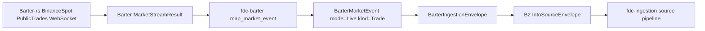

# fdc-barter Live Exchange Acquisition Design

Date: 2026-05-21
Branch: `mdb-mqdev`
Status: Proposed

## Purpose

Implement the first real exchange data acquisition path in `fdc-barter`: live Binance Spot public trades for BTC/USDT and ETH/USDT. The adapter remains a thin boundary around Barter-rs. It starts Barter's existing live stream, maps received market events into `BarterIngestionEnvelope`, and lets the existing B2 source-envelope bridge hand data to `fdc-ingestion` when needed.

This slice intentionally does not build a separate source runtime, reconnect framework, persistence layer, or historical data path. Barter-rs already owns WebSocket connection behavior and reconnect handling.

## Scope

### In Scope

- Use Barter-rs `barter-data` live WebSocket streams for `BinanceSpot` `PublicTrades`.
- Provide a small `fdc-barter` live acquisition API that:
  - builds the default Binance Spot BTC/USDT and ETH/USDT trade subscriptions;
  - starts Barter `Streams::<PublicTrades>` for those subscriptions;
  - maps successful Barter market events through the existing `map_market_event` function;
  - wraps mapped events with `BarterIngestionEnvelope::from_event(source_id, event)`;
  - exposes a bounded helper that can collect the next N envelopes for smoke tests and ingestion-pipeline integration tests.
- Preserve the existing dependency boundary:
  - `fdc-barter` may depend on `fdc-ingestion` for the B2 bridge already added;
  - `fdc-ingestion` must not depend on or reference `fdc-barter`.
- Keep default tests deterministic by using fake/in-memory streams or synthetic Barter events.
- Gate real network tests behind `#[ignore]` and/or an explicit environment variable.

### Not In Scope

- Historical data fetching.
- Custom reconnect, retry, or stream lifecycle framework in `fdc-barter`.
- Durable checkpoint persistence.
- Storage sinks, transform sinks, or analytics output.
- Private/authenticated exchange streams.
- Multi-exchange or multi-kind dynamic subscription routing.
- Order book, candle, or liquidation acquisition beyond preserving model compatibility.

## Requirements

### Functional Requirements

- FR-1: `fdc-barter` can construct the default Binance Spot public trade subscriptions for BTC/USDT and ETH/USDT.
- FR-2: `fdc-barter` can start a Barter-rs live stream for those subscriptions using Barter's existing stream and reconnect machinery.
- FR-3: Successful Barter market events are converted to `BarterMarketEvent` with `mode = Live`, `kind = Trade`, exchange `binance_spot`, and normalized symbols such as `BTCUSDT`.
- FR-4: Converted events are wrapped in `BarterIngestionEnvelope` with the configured `source_id`.
- FR-5: Envelope output remains compatible with `IntoSourceEnvelope`, producing `SourceType::MarketData` for live trades.
- FR-6: A bounded collection helper can return up to N envelopes without requiring downstream storage.
- FR-7: Stream item errors are surfaced as `BarterAdapterError` values and do not panic the adapter.

### Non-Functional Requirements

- NFR-1: Default unit and contract tests must not require network access.
- NFR-2: Real network validation must be opt-in and safe to skip in CI.
- NFR-3: The adapter should remain thin and should not duplicate Barter's reconnect semantics.
- NFR-4: New APIs should be small, explicit, and compatible with future expansion to other exchanges or data kinds.

## Proposed API Shape

Add a live acquisition module under `crates/fdc-adapter/barter/src/ingestion/live.rs` and export it from `ingestion::mod`.

Suggested public types/functions:

```rust
pub struct LiveTradeSubscription {
    pub exchange: LiveExchange,
    pub base: String,
    pub quote: String,
}

pub enum LiveExchange {
    BinanceSpot,
}

pub fn default_binance_spot_trade_subscriptions() -> Vec<LiveTradeSubscription>;

pub async fn init_binance_spot_public_trades(
    subscriptions: impl IntoIterator<Item = LiveTradeSubscription>,
) -> Result<BarterLiveTradeStreams>;

pub fn map_live_trade_result(
    source_id: &str,
    item: MarketStreamResult<MarketDataInstrument, DataKind>,
) -> Result<BarterIngestionEnvelope>;

pub async fn collect_live_trade_envelopes<S>(
    source_id: &str,
    stream: S,
    limit: usize,
) -> Result<Vec<BarterIngestionEnvelope>>
where
    S: Stream<Item = MarketStreamResult<MarketDataInstrument, DataKind>> + Unpin;
```

The exact wrapper name for returned Barter streams can be adjusted to fit Barter's concrete `Streams<PublicTrades>` type. The key design point is that `fdc-barter` owns only the conversion and handoff boundary, not stream lifecycle semantics.

## Data Flow



## Error Handling

- Barter stream initialization errors are converted into a `BarterAdapterError` variant such as `LiveStreamInit`.
- Barter stream item errors are converted into a `BarterAdapterError` variant such as `LiveStreamItem`.
- Unsupported live subscriptions are rejected before stream initialization.
- Mapping failures, including invalid timestamps or numeric values, reuse existing mapper errors.
- The adapter does not panic on exchange stream errors.

## Testing Plan

- Contract tests:
  - default Binance Spot subscriptions contain exactly BTC/USDT and ETH/USDT trade subscriptions;
  - synthetic Barter trade events map to `BarterIngestionEnvelope` with live mode, trade kind, expected exchange, expected symbols, and default quality flags;
  - mapped live envelopes convert through `IntoSourceEnvelope` as `SourceType::MarketData`;
  - bounded collection over an in-memory fake stream returns exactly the requested number of envelopes;
  - stream item errors are returned as adapter errors rather than panics;
  - dependency guard confirms `fdc-ingestion` has no `fdc-barter` references.
- Optional ignored live smoke test:
  - with an explicit environment variable, connect to Binance Spot public trades and collect at least one envelope within a timeout.

## Acceptance Criteria

- `cargo test -p fdc-barter` passes without network access.
- The ignored live smoke test can be run manually when network access is available.
- `cargo test -p fdc-barter -p fdc-ingestion` still passes.
- Dependency guard shows no `fdc-barter` or `fdc_barter` references inside `crates/fdc-ingestion`.
- The public API does not expose a custom reconnect or lifecycle framework.

## Open Decisions Resolved

- First exchange/data kind: Binance Spot PublicTrades.
- First symbols: BTC/USDT and ETH/USDT.
- Historical data: deferred.
- Reconnect behavior: delegated to Barter-rs.
- Storage/checkpoint persistence: deferred.
