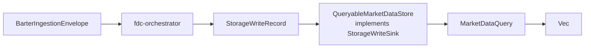

# B9 Queryable Market Data Storage Boundary Design

## Goal

Build the first MVP bridge between storage writes and reads: records produced by the existing Barter -> orchestrator -> storage-write pipeline must be queryable in memory by market-data dimensions such as symbol, kind, and limit.

This is the next slice in方案 B: data acquisition -> storage -> query. B9 stops at an in-process queryable storage boundary. B10 will expose it through API/router state.

## Current Context

Already available:

- `fdc-barter` can collect bounded live Binance Spot trade envelopes.
- `fdc-orchestrator::run_barter_envelopes_to_storage_once` maps `BarterIngestionEnvelope` into `StorageWriteRecord` and writes to any `StorageWriteSink`.
- `fdc-storage` owns generic `StorageWriteRecord`, `StorageWriteBatch`, `StorageWriteSink`, and `RecordingStorageSink`.
- `StorageWriteRecord` already carries metadata tags created by the orchestrator: `adapter`, `exchange`, `symbol`, and `kind`.

Gap:

- `RecordingStorageSink` stores records for verification but exposes no query-specific API.
- Existing `fdc-query` SQL executor still returns simulated tables and is not ready to be the MVP read path.

## Design Summary

Add a focused in-memory market-data store inside `fdc-storage`:

- It implements `StorageWriteSink`, so existing orchestrator code can write into it without changes.
- It records accepted `StorageWriteRecord` values in memory.
- It exposes a storage-owned read API for market-data records.
- It does not depend on `fdc-transform`, `fdc-orchestrator`, `fdc-barter`, or `fdc-api`.

The read API works on generic storage records and their metadata. It returns cloned `StorageWriteRecord` values. Decoding the JSON payload into domain DTOs remains outside `fdc-storage` for now.

## Components

### `MarketDataQuery`

Located in `crates/fdc-storage/src/queryable.rs`.

Fields:

- `namespace: String`, default `market_data`
- `collection: Option<String>`, e.g. `trades`
- `symbol: Option<String>`
- `kind: Option<String>`, e.g. `trade`
- `limit: Option<usize>`

Builder methods:

- `MarketDataQuery::new()`
- `for_trades()`
- `with_symbol(...)`
- `with_kind(...)`
- `with_collection(...)`
- `with_limit(...)`

### `QueryableMarketDataStore`

Located in `crates/fdc-storage/src/queryable.rs`.

Responsibilities:

- Implement `StorageWriteSink`.
- Validate batches atomically before mutating state.
- Store records in insertion order.
- Query records by namespace, optional collection, optional `metadata.tags["symbol"]`, optional `metadata.tags["kind"]`, and optional limit.
- Expose `record_count()` and `all_records()` for tests and future diagnostics.

### Public Exports

`crates/fdc-storage/src/lib.rs` exports:

- `MarketDataQuery`
- `QueryableMarketDataStore`

## Data Flow

## Scope

In scope:

- In-memory queryable market-data storage boundary.
- Query by symbol, kind, collection, namespace, and limit.
- End-to-end fixture test using `fdc-orchestrator::run_barter_envelopes_to_storage_once`.
- Preserve storage decoupling from upstream crates.

Out of scope:

- Persistent tier routing.
- DuckDB/RocksDB/redb integration.
- SQL query engine integration.
- API route exposure.
- Live runner lifecycle.
- DTO decoding inside `fdc-storage`.

## Error Handling

- Empty or invalid batches use existing `StorageWriteBatch::validate()` and fail before mutating state.
- Query filters are exact-match and case-sensitive in B9 because orchestrator writes canonical symbols like `BTCUSDT`.
- `limit = 0` returns an empty vector.

## Testing Strategy

Add tests in `crates/fdc-storage/tests/queryable_market_data_store_contract.rs`:

1. Valid market-data records are stored and returned by symbol.
2. Multiple symbols can be filtered independently.
3. `for_trades().with_limit(1)` returns only one record.
4. Empty/invalid batches are rejected atomically.
5. Storage dependency guard confirms `fdc-storage` still does not reference upstream crates.

Add integration test in `crates/fdc-orchestrator/tests/orchestrator_queryable_storage_contract.rs`:

1. A Barter trade fixture flows through orchestrator into `QueryableMarketDataStore`.
2. Querying `BTCUSDT` trades returns the stored record.
3. The stored JSON payload still contains the expected market-data DTO fields.

## Acceptance Criteria

- Given a valid `StorageWriteRecord` tagged with `symbol=BTCUSDT` and `kind=trade`, when it is written to `QueryableMarketDataStore`, then querying `for_trades().with_symbol("BTCUSDT")` returns exactly that record.
- Given BTC and ETH records, when querying `ETHUSDT`, then only ETH records are returned.
- Given two matching records and limit `1`, then only one record is returned in insertion order.
- Given an invalid batch, then write fails and existing store contents are unchanged.
- Given a Barter fixture envelope, when `run_barter_envelopes_to_storage_once` writes to `QueryableMarketDataStore`, then a market-data trade query returns the record.

## Next Slice

B10 should use this store from server/API state and expose one bounded in-memory readiness/query route, without starting real listeners or adding production persistence.
