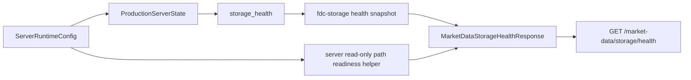

# P29 Durable Path/Disk Health Hardening Design

Date: 2026-06-07
Branch: `mdb-mqdev`

## Goal

Extend the existing read-only `GET /market-data/storage/health` route with safe durable path readiness signals so operators can see whether configured durable tier paths look usable before relying on tiered runtime persistence.

The feature remains server-owned. `fdc-storage` must stay generic and must not receive server runtime, admin route, or market-data API semantics.

## Scope

Extend `MarketDataStorageTierHealth` with server-owned durable path health fields:

- `durable_path_configured: bool`
- `path_hint: Option<String>`
- `path_exists: Option<bool>`
- `path_parent_exists: Option<bool>`
- `path_parent_writable: Option<bool>`

Field semantics:

- `durable_path_configured` is true when the server runtime config has a durable path for that tier.
- `path_hint` is the basename only, matching the status route path hint behavior.
- `path_exists` is `Some(path.exists())` for configured durable paths, otherwise `None`.
- `path_parent_exists` is `Some(parent.exists())` for configured durable paths with a parent, otherwise `None`.
- `path_parent_writable` is a safe read-only approximation:
  - `Some(false)` when the configured path has no parent, the parent is missing, metadata lookup fails, or parent metadata is readonly.
  - `Some(true)` when parent metadata exists and is not readonly.
  - `None` when no durable path is configured.

This does not guarantee future writes will succeed. It is an operator readiness hint, not a write probe.

## Non-goals

- Do not add a new route.
- Do not modify `fdc-storage`.
- Do not expose full filesystem paths.
- Do not create files or directories as part of health checks.
- Do not perform free-space checks in this slice. Free-space can be added later with platform-specific care.
- Do not trigger maintenance, compaction, TTL deletion, retention deletion, retention demotion, audit clear, or audit reset.
- Do not change storage engine initialization semantics.

## Options considered

### Option A: Add path readiness fields to `/market-data/storage/health`

Add durable path readiness to each health tier row.

Pros:

- Health is the natural place for runtime readiness signals.
- Existing tier health rows already report initialized/status/key_count/total_size.
- Keeps status focused on runtime config summary.
- No `fdc-storage` change.

Cons:

- Adds server-runtime-derived fields to health rows that are otherwise partly storage-snapshot-derived.

### Option B: Add path readiness fields to `/market-data/storage/status`

Add the same fields to the status tier summaries.

Pros:

- Status already reports path hints and durable path configured booleans.

Cons:

- Status becomes a readiness endpoint and duplicates health concerns.
- P28 intentionally kept status as config/admin summary.

### Option C: Add a new `/market-data/storage/path-health` route

Create a route dedicated to durable path readiness.

Pros:

- Clean separation.

Cons:

- More route surface for a small amount of metadata.
- Duplicates backend/tier context already in health.
- YAGNI for current needs.

## Decision

Use Option A: extend `GET /market-data/storage/health` tier rows.

## API design

Memory backend remains unchanged at the route level: `tiers` is empty because there are no tier health rows for the memory backend.

Tiered memory-backed runtime example:

```json
{
  "backend": "tiered",
  "tiered": true,
  "status": "healthy",
  "tiers": [
    {
      "tier": "L1",
      "enabled": true,
      "initialized": true,
      "status": "healthy",
      "key_count": 0,
      "total_size": 0,
      "durable_path_configured": false,
      "path_hint": null,
      "path_exists": null,
      "path_parent_exists": null,
      "path_parent_writable": null
    }
  ]
}
```

Tiered durable runtime example:

```json
{
  "tier": "L2",
  "enabled": true,
  "initialized": true,
  "status": "healthy",
  "key_count": 0,
  "total_size": 0,
  "durable_path_configured": true,
  "path_hint": "l2.redb",
  "path_exists": true,
  "path_parent_exists": true,
  "path_parent_writable": true
}
```

If a configured durable path points at a missing parent, the health row should show:

```json
{
  "durable_path_configured": true,
  "path_exists": false,
  "path_parent_exists": false,
  "path_parent_writable": false
}
```

## Data flow



The service keeps using the generic storage health snapshot for engine/tier health. It separately merges server runtime path readiness metadata based on `state.config().market_data_storage.tiers`.

## File-level design

- `crates/fdc-server/src/market_data/model.rs`
  - Extend `MarketDataStorageTierHealth` with the five path readiness fields.
- `crates/fdc-server/src/market_data/service.rs`
  - Add a small server-owned helper that maps tier labels to configured durable paths.
  - Add a read-only path readiness helper using `Path::exists`, `Path::parent`, and `std::fs::metadata`.
  - Merge path readiness into every tier health row.
- `crates/fdc-server/tests/production_server_router_contract.rs`
  - Extend tiered health tests for memory-backed tiers.
  - Add durable tier path readiness coverage.
  - Verify the response does not leak full configured paths.

## Testing strategy

Use TDD.

1. Extend `production_storage_health_tiered_backend_reports_initialized_tiers` with assertions that memory-backed tiered rows have:
   - `durable_path_configured == false`
   - `path_hint == null`
   - `path_exists == null`
   - `path_parent_exists == null`
   - `path_parent_writable == null`
2. Add `production_storage_health_reports_durable_path_readiness_without_full_paths`:
   - configure tiered backend and durable L2/L3/L4 paths with the existing helper.
   - build `ProductionServerState::try_new` so engines initialize and paths are present.
   - assert L2/L3/L4 rows report `durable_path_configured == true`, basename `path_hint`, and readiness booleans true where applicable.
   - assert body text does not contain the root temp path.
3. Add `production_storage_health_reports_missing_durable_path_parent`:
   - configure only L2 durable path with a parent directory that is intentionally missing.
   - use `ProductionServerState::new` or a construction path that does not force engine initialization failure if needed.
   - verify the health path readiness helper reports missing parent without writing or creating anything.

If engine initialization requires parents to exist, keep the missing-parent case on `storage_status` out of scope and cover it with a unit test for the server helper instead. The helper must remain private or `pub(crate)` only inside server.

Focused verification:

- `rtk cargo test -p fdc-server --test production_server_router_contract production_storage_health`
- `rtk cargo test -p fdc-server --test production_server_router_contract production_storage_status`
- `rtk cargo test -p fdc-server --test production_server_router_contract storage_maintenance_run_once`
- `rtk cargo test -p fdc-storage --test dependency_guard`
- `cargo fmt -p fdc-server -p fdc-storage -- --check`

## Boundary and safety checks

- No `fdc-storage` API change.
- No upper-layer crate dependency added to `fdc-storage`.
- Path checks are read-only.
- Full paths are not exposed.
- The health route remains read-only and does not trigger maintenance or reset.

## Spec self-review

- No placeholders remain.
- Scope is one existing route response and server-owned helper logic.
- Field semantics are explicit.
- The path writability check is intentionally defined as read-only approximation, not a write guarantee.
- The storage boundary remains intact.
