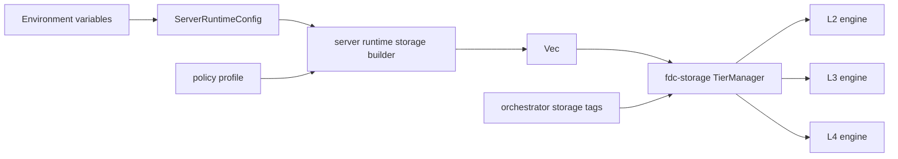

# P19 Durable Tier Configuration Design

Date: 2026-06-07

## Goal

Add runtime configuration for durable storage tiers so the production server can assemble tiered market-data storage with explicit physical L2/L3/L4 paths and engines, while preserving `fdc-storage` as a generic storage layer.

## Non-goals

- No market-data DTO, Barter, orchestrator, or server dependency inside `fdc-storage`.
- No per-write physical tier selection from runtime config.
- No new durable engine implementation in this slice.
- No global repository formatting cleanup.

## Current state

`fdc-storage` already has generic tier primitives:

- `TierConfig { tier, engine_type, engine_config, ... }`
- `StorageEngineType::{Memory, Redb, DuckDB, RocksDB}`
- durable engines read `engine_config["db_path"]`:
  - L2/redb: file path
  - L3/DuckDB: file path
  - L4/RocksDB: directory path
- `TierManager::initialize()` builds engines from `TierConfig`.
- Server runtime currently selects only backend and policy profile:
  - `FDC_MARKET_DATA_STORAGE_BACKEND=memory|tiered`
  - `FDC_MARKET_DATA_STORAGE_POLICY_PROFILE=compatibility|generic_realtime`
- `QueryableMarketDataStore::memory_tiered_with_policy(...)` intentionally uses memory engines for all tiers, which is safe for tests but not durable.

## Options considered

### Option A: Path config only in server runtime, translated to generic `TierConfig`

Server parses a small tier storage config with optional L2/L3/L4 paths. The server storage builder converts those values into generic `TierConfig`s and passes them to `fdc-storage`.

Pros:

- Keeps storage generic.
- Keeps market-data/runtime defaults in server.
- Works with existing engine `db_path` config.
- Easy to test without real server startup.

Cons:

- Server must know which durable engine is appropriate for L2/L3/L4.

### Option B: Add a storage-level durable profile factory

Add something like `TieredStorageStore::durable_default(root_path, policy)` in `fdc-storage`.

Pros:

- Reusable across callers.
- Encapsulates default L2/L3/L4 engine mapping in storage.

Cons:

- Harder to keep runtime-specific path policy out of storage.
- Still needs server parsing and root-path conventions.

### Option C: Full per-tier engine config in environment variables

Expose engine type and raw config key/value pairs for each tier.

Pros:

- Maximum flexibility.

Cons:

- Overly broad for this roadmap slice.
- Harder to validate.
- Encourages runtime operators to bypass storage-owned tiering semantics.

## Decision

Use Option A for P19.

Server runtime will parse durable tier paths and build generic `TierConfig`s. `fdc-storage` remains unaware of market-data DTOs and runtime environment variables.

## Runtime config shape

Extend `MarketDataStorageRuntimeConfig` with a tier configuration field:

```rust
pub struct MarketDataStorageRuntimeConfig {
    pub backend: MarketDataStorageBackendConfig,
    pub policy_profile: MarketDataStoragePolicyProfileConfig,
    pub tiers: MarketDataStorageTierRuntimeConfig,
}
```

The tier config will keep optional durable paths:

```rust
pub struct MarketDataStorageTierRuntimeConfig {
    pub l2_redb_path: Option<PathBuf>,
    pub l3_duckdb_path: Option<PathBuf>,
    pub l4_rocksdb_path: Option<PathBuf>,
}
```

Environment variables:

- `FDC_MARKET_DATA_STORAGE_L2_REDB_PATH`
- `FDC_MARKET_DATA_STORAGE_L3_DUCKDB_PATH`
- `FDC_MARKET_DATA_STORAGE_L4_ROCKSDB_PATH`

Parsing rules:

- Empty values are invalid when provided.
- Paths are not required for `backend=memory`.
- For `backend=tiered`, missing paths keep the current memory-backed tier behavior for that tier. This preserves safe defaults for tests and development.
- Path configuration does not decide placement. It only decides the physical engine backing each tier.

## Storage assembly

Add a storage constructor that accepts already-built generic tier configs, for example:

```rust
TieredStorageStore::with_tier_configs(policy, configs).await
QueryableMarketDataStore::tiered_with_policy_and_configs(policy, configs).await
```

The server builder will:

1. Select policy from `policy_profile`.
2. Build configs for L1-L4.
3. Always keep L1 as memory.
4. Use durable engines only when the corresponding path is configured:
   - L2 path -> `StorageEngineType::Redb`, `engine_config["db_path"] = path`
   - L3 path -> `StorageEngineType::DuckDB`, `engine_config["db_path"] = path`
   - L4 path -> `StorageEngineType::RocksDB`, `engine_config["db_path"] = path`
5. Use memory for any tier without an explicit durable path.
6. Pass configs into `fdc-storage` as generic `TierConfig`s.

## Data flow



Important boundary: orchestrator/server may know market-data facts and runtime paths. `fdc-storage` only sees generic tags, placement hints, and generic tier engine configs.

## Error handling

- Environment parsing returns `Error::config` for empty path values.
- Storage initialization errors propagate from engine constructors/initializers.
- If a policy routes to a tier whose engine failed or was not initialized, existing `TierManager` validation errors remain the source of truth.

## Testing

Follow TDD:

1. Add runtime config contract tests for env parsing:
   - durable path env vars are parsed into `MarketDataStorageRuntimeConfig.tiers`.
   - empty path values are rejected.
2. Add server storage builder unit/integration tests:
   - with no paths, tiered runtime still builds memory-backed tiers and existing generic realtime routing passes.
   - with temp durable paths for L2/L3/L4, tiered runtime builds and can write/query live/backfill records.
   - optional: verify files/directories exist at configured paths after initialization.
3. Add or update storage constructor tests to prove generic `TierConfig`s are accepted without server-specific types.

## Success criteria

- Server runtime can configure L2/L3/L4 physical paths through env vars.
- Durable paths are translated only into generic `TierConfig.engine_config["db_path"]` values.
- Existing memory-only tiered tests continue passing.
- Generic realtime policy still routes live data to L2 and backfill data to L3.
- `fdc-storage` has no new market-data/server dependency.
