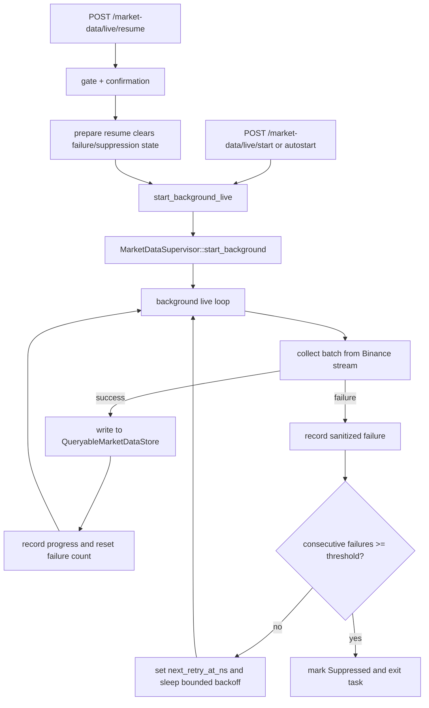

# P36 Live Collection Hardening Design

Status: Draft approved in conversation on 2026-06-08
Branch: `mdb-mqdev`

## Goal

Harden production live market-data collection so it can run unattended for long periods without silently failing. P36 adds bounded retry, failure suppression, richer live status, and an explicit gated resume control for operators.

This is the first stage of the path toward formal service operation:

1. P36 live collection hardening.
2. P37 acquisition to four-tier storage to query end-to-end acceptance.
3. P38 query API hardening.
4. P39 production runbook and smoke tooling.

P36 intentionally focuses on live collection lifecycle only.

## Current Context

The production server already exposes:

- `POST /market-data/live/start`
- `POST /market-data/live/stop`
- `GET /market-data/live/status`
- storage health/status/maintenance/audit/scheduler routes
- `GET /market-data/trades`

The current live runner starts a background loop through `start_background_live`. Each loop iteration calls live Binance Spot collection with configured `timeout_secs` and `max_envelopes`, writes envelopes into `QueryableMarketDataStore`, and records progress in `MarketDataSupervisor`.

Current gaps:

- A transient stream/network/storage failure moves the live runner to `failed` and stops the background loop.
- Status exposes basic counters and `failure_message`, but not failure count, retry schedule, suppression, or resume readiness.
- There is no explicit production-grade resume control for a suppressed/failed live runner.
- `/market-data/live/start` currently owns normal startup semantics and should not also become the operator recovery semantic.

## Chosen Approach

Use an explicit live lifecycle model similar to the storage maintenance scheduler controls added in P33-P35.

P36 will add:

- bounded automatic retry inside the live background task;
- suppression after a configured number of consecutive failures;
- richer live status fields for operational visibility;
- an explicit confirmation-protected resume route;
- default-safe config gates for recovery controls.

This avoids using `/market-data/live/start` as an overloaded recovery endpoint and keeps production recovery actions auditable and intentional.

## Non-goals

P36 will not:

- add or change storage maintenance behavior;
- clear market-data records or maintenance audit entries;
- change tier paths or storage policy;
- implement the P37 four-tier end-to-end acceptance suite;
- extend the query API beyond current `GET /market-data/trades` behavior;
- create deployment scripts or runbooks beyond documenting this design and status.

## Architecture

### Components

#### `market_data/supervisor.rs`

`MarketDataSupervisor` remains the server-owned live lifecycle state machine. It will be extended to track retry/suppression state and expose immutable snapshots through the existing status DTO.

New state/counters:

- `consecutive_failures`
- `retry_count`
- `last_error`
- `last_error_at_ns`
- `next_retry_at_ns`
- `suppressed_reason`
- `resume_enabled` in status responses, derived from runtime config in the service layer rather than stored in supervisor state

`MarketDataLiveState` will add:

- `Suppressed`

Suppression means the background live task stopped attempting collection after hitting the configured consecutive failure threshold. It does not imply storage data loss, maintenance failure, or process unhealthiness.

#### `market_data/service.rs`

Service functions keep business semantics out of handlers.

Live start behavior remains responsible for normal start. The background loop will:

1. run one live collection batch;
2. on success, record progress and reset consecutive failure state;
3. on failure, sanitize/store the error and increment counters;
4. if the threshold is not reached, schedule a retry with bounded backoff;
5. if the threshold is reached, mark the live supervisor suppressed and exit;
6. honor `stop_requested` before sleeping, after sleeping, and before each batch.

A new resume service will validate the runtime gate and confirmation, prepare the supervisor for resume, and start a fresh live background loop using the existing default live request configuration.

#### `market_data/model.rs`

Add DTOs:

```rust
pub struct ResumeLiveMarketDataRequest {
    pub confirm: String,
    pub reason: Option<String>,
}

pub struct ResumeLiveMarketDataResponse {
    pub state: MarketDataLiveState,
    pub task_id: Option<String>,
    pub resumed: bool,
    pub reason: Option<String>,
    pub consecutive_failures: u32,
    pub retry_count: u64,
    pub next_retry_at_ns: Option<u64>,
}
```

Extend `LiveMarketDataStatusResponse` with retry/suppression fields:

- `consecutive_failures: u32`
- `retry_count: u64`
- `last_error: Option<String>`
- `last_error_at_ns: Option<u64>`
- `next_retry_at_ns: Option<u64>`
- `suppressed_reason: Option<String>`
- `resume_enabled: bool`

The supervisor-owned snapshot will not store `resume_enabled`; the service layer will add runtime config visibility to the final status JSON contract.

#### `market_data/router.rs`

Add:

- `POST /market-data/live/resume`

Response envelope follows existing `ServerApiResponse<T>` style. HTTP status mapping follows scheduler recovery conventions:

- `200 OK` for successful resume or benign no-op response;
- `400 BAD_REQUEST` for wrong confirmation;
- `403 FORBIDDEN` when the resume gate is disabled;
- `409 CONFLICT` when live collection is starting/running/stopping or another live task is active.

#### `runtime/config.rs`

Add runtime config:

- `FDC_LIVE_RETRY_ENABLED`
  - default: `true`
  - only effective when `FDC_LIVE_ENABLED=1`
- `FDC_LIVE_RETRY_INITIAL_DELAY_MS`
  - default: `1000`
  - accepted range: `100..=600000`
- `FDC_LIVE_RETRY_MAX_DELAY_MS`
  - default: `30000`
  - accepted range: `100..=3600000`
  - must be greater than or equal to initial delay
- `FDC_LIVE_MAX_CONSECUTIVE_FAILURES`
  - default: `3`
  - accepted range: `1..=100`
- `FDC_MARKET_DATA_LIVE_RESUME_ENABLED`
  - default: `false`

The resume gate remains separate from `FDC_LIVE_ENABLED`. A resume request still requires live collection to be enabled; if `FDC_LIVE_ENABLED=0`, resume should fail with a disabled message rather than starting collection.

#### `runtime/app.rs`

Autostart continues to call the normal start path. It does not bypass retry/suppression, and it does not implicitly resume a previously suppressed state after process start because process-local suppression state is reset on restart.

## Data Flow



## Error Handling and Safety

- Errors stored in status must be sanitized to one line and bounded in length, following the scheduler failure sanitization pattern.
- Retry sleep must be interruptible by stop requests. The implementation must check stop state before sleeping, after sleeping, and before each batch.
- Stop requests always win over retry and resume.
- Resume does not clear records, audit entries, storage maintenance scheduler state, storage paths, or tier data.
- Resume does not run storage maintenance.
- A rejected live task start must not detach an uncontrolled background task.
- Suppressed state is process-local. Restarting the service clears process-local live supervisor state, which matches current in-memory supervisor behavior.

## API Contract

### `GET /market-data/live/status`

Existing fields remain. New fields are added:

```json
{
  "data": {
    "state": "suppressed",
    "task_id": "market-data-live-3",
    "consecutive_failures": 3,
    "retry_count": 2,
    "last_error": "failed while collecting live market data: ...",
    "last_error_at_ns": 123456789,
    "next_retry_at_ns": null,
    "suppressed_reason": "suppressed_after_failures",
    "resume_enabled": false
  },
  "status": "success",
  "message": null
}
```

### `POST /market-data/live/resume`

Request:

```json
{
  "confirm": "resume_live_collection",
  "reason": "operator cleared connectivity issue"
}
```

Confirmation string:

- `resume_live_collection`

Success response:

```json
{
  "data": {
    "state": "running",
    "task_id": "market-data-live-4",
    "resumed": true,
    "reason": "operator cleared connectivity issue",
    "consecutive_failures": 0,
    "retry_count": 0,
    "next_retry_at_ns": null
  },
  "status": "success",
  "message": null
}
```

Failure examples:

- `403 disabled`: resume gate disabled or live collection disabled.
- `400 confirmation_required`: `confirm` is not `resume_live_collection`.
- `409 conflict`: live collection is already starting/running/stopping or another live task is active.

## Testing Strategy

P36 must be implemented test-first.

### Config contract tests

- Defaults are safe:
  - retry enabled by default;
  - resume disabled by default;
  - max failures/default delays match documented values.
- Env overrides parse correctly.
- Invalid delay ranges and failure thresholds are rejected.

### Supervisor tests

- Consecutive failures increment and store sanitized errors.
- Success after a failure resets `consecutive_failures` and clears retry scheduling.
- Failure threshold marks state `suppressed` and clears `next_retry_at_ns`.
- Stop request prevents retry from continuing.
- Resume preparation clears failure/suppression state only when safe.

### Service tests

- Retry loop schedules retries for transient failure and suppresses after threshold using a test seam.
- Resume returns forbidden when gate is disabled.
- Resume returns bad request for wrong confirmation.
- Resume returns conflict for running/starting/stopping states.
- Resume from suppressed state starts a new live background task through the normal start path.

### Router contract tests

- `GET /market-data/live/status` includes retry/suppression fields.
- `POST /market-data/live/resume` returns the expected HTTP status and JSON envelope for disabled, confirmation-required, conflict, and success paths.

### Regression verification

- Existing live start/stop/status tests remain green.
- Existing production background live smoke remains ignored unless explicitly run.
- P35 scheduler focused tests remain green.
- `fdc-storage` dependency guard remains green.
- `cargo fmt -p fdc-server -p fdc-storage -- --check` passes.

## Operational Guidance

Recommended production stance after P36:

- Enable live collection with `FDC_LIVE_ENABLED=1` only in environments intended to reach public market-data sources.
- Keep `FDC_MARKET_DATA_LIVE_RESUME_ENABLED=0` by default.
- Enable resume only during an operator recovery window.
- Use `/market-data/live/status` before and after resume.
- Use `/market-data/storage/health` and maintenance audit routes separately to validate storage health; live resume does not validate or repair storage.

## Acceptance Criteria

P36 is complete when:

1. Live collection can retry transient failures with bounded backoff.
2. Repeated failures suppress live collection after the configured threshold.
3. Status exposes failure count, retry count, last error, retry schedule, suppression reason, and resume gate visibility.
4. Operators can explicitly resume suppressed/failed live collection through a default-disabled confirmation-protected route.
5. Stop requests override retry/resume behavior.
6. No storage data, audit data, maintenance scheduler state, or storage tier paths are modified by live resume.
7. Focused tests and regressions pass.

## Future Work

P37 should add end-to-end acceptance that proves live/fixture acquisition writes into configured tiered storage and can be queried through service APIs after maintenance. P38 should harden query filters, limits, and pagination. P39 should add production runbook and smoke tooling.
