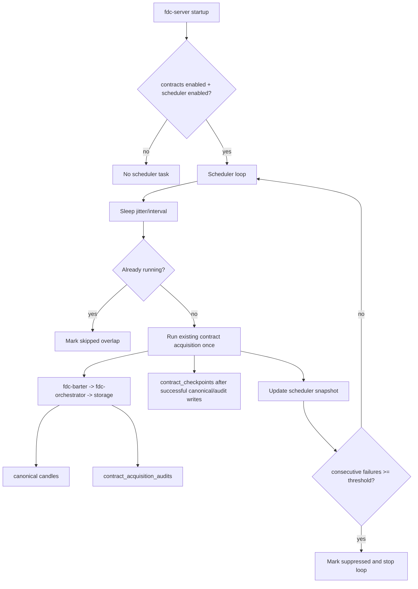

# Contract Candle Long-Term Maintenance Scheduler Design

Date: 2026-07-12
Branch: `contract-candle-long-term-maintenance`
Target: `mdb-mqdev`

## Scope

Build the next Phase 1 step for Binance Futures USD perpetual OHLCV/candle data: long-term automatic maintenance inside `fdc-server`.

This work remains limited to contract candles. It does not add funding rate, open interest, mark price, index price, liquidation, factor calculation, strategy logic, or alternative data surfaces.

## Goals

- Run configured Binance Futures USD perpetual candle acquisition repeatedly without an external cron.
- Continue using the existing canonical path: `fdc-barter -> fdc-orchestrator -> fdc-storage -> candles`.
- Reuse existing bounded acquisition runs and storage-backed checkpoints.
- Expose scheduler health and counters for operator visibility.
- Avoid overlapping runs.
- Suppress the scheduler after repeated failures to avoid repeatedly hitting Binance or hiding operational issues.
- Keep `contract_checkpoints` and `contract_acquisition_audits` as maintenance metadata, not factor input surfaces.

## Non-Goals

- No factor or strategy implementation.
- No new canonical data collection beyond `candles`.
- No sidecar/local-temp storage shortcut.
- No external cron-only solution.
- No expansion to non-candle derivative data kinds.
- No full observability stack or alert delivery integration in this iteration.

## Recommended Approach

Add an independent contract candle maintenance scheduler that lives beside the existing storage maintenance scheduler. It should reuse existing contract acquisition code rather than duplicating Binance or storage logic.

The scheduler is enabled only when both:

- `FDC_MARKET_DATA_CONTRACTS_ENABLED=1`
- `FDC_MARKET_DATA_CONTRACTS_SCHEDULER_ENABLED=1`

`FDC_MARKET_DATA_CONTRACTS_AUTOSTART` keeps its current meaning: run a bounded acquisition once on server startup. The new scheduler controls recurring maintenance.

## Runtime Configuration

Add these runtime config fields under contract acquisition:

- `scheduler_enabled: bool`, default `false`
- `scheduler_interval_seconds: u64`, default `3600`
- `scheduler_jitter_seconds: u64`, default `0`
- `scheduler_max_consecutive_failures: u32`, default `3`

Environment variables:

- `FDC_MARKET_DATA_CONTRACTS_SCHEDULER_ENABLED`
- `FDC_MARKET_DATA_CONTRACTS_SCHEDULER_INTERVAL_SECONDS`
- `FDC_MARKET_DATA_CONTRACTS_SCHEDULER_JITTER_SECONDS`
- `FDC_MARKET_DATA_CONTRACTS_SCHEDULER_MAX_CONSECUTIVE_FAILURES`

Validation should follow existing runtime config conventions:

- interval: positive, bounded enough for production safety
- jitter: non-negative, bounded
- max failures: positive, bounded

## Scheduler State

Create a scheduler state object similar in spirit to the storage maintenance scheduler state, but scoped to contract candle acquisition.

Snapshot fields should include:

- `enabled`
- `running`
- `suppressed`
- `interval_seconds`
- `jitter_seconds`
- `max_consecutive_failures`
- `total_runs`
- `successful_runs`
- `failed_runs`
- `skipped_runs`
- `consecutive_failures`
- `last_status`
- `last_error`
- `last_started_at`
- `last_completed_at`
- `next_run_at`
- last acquisition counters:
  - `tasks_started`
  - `tasks_completed`
  - `pages_fetched`
  - `envelopes_received`
  - `storage_records_written`
  - `audit_records_written`

The state must be in-memory runtime state. Durable acquisition details remain in `contract_acquisition_audits` and checkpoints remain in `contract_checkpoints`.

## Data Flow



## Error Handling

- If acquisition succeeds, mark the scheduler attempt completed and reset consecutive failures.
- If acquisition returns an error, mark failed, store a sanitized error string, and increment consecutive failures.
- If another run is already in progress, skip the attempt and increment skipped runs. This should not count as an acquisition failure.
- Once consecutive failures reaches the configured threshold, mark the scheduler suppressed and stop recurring attempts.
- Checkpoints must continue to advance only after canonical candle writes and acquisition audit writes succeed.

## API Surface

Prefer extending the existing contract acquisition status response if the current DTO can be evolved cleanly. Otherwise add a scheduler-specific status endpoint.

Recommended endpoint:

- `GET /market-data/contracts/acquisition/scheduler/status`

Response data should mirror the scheduler snapshot and include enough counters for operators to know whether recurring acquisition is healthy.

Existing endpoints remain:

- `POST /market-data/contracts/acquisition/run-once`
- `GET /market-data/contracts/acquisition/status`
- `GET /market-data/candles`

Manual run-once should remain available even when scheduler is disabled, as long as contract acquisition itself is enabled.

## Startup Behavior

On production server startup:

1. Existing autostart behavior remains unchanged.
2. If scheduler config is enabled, spawn a background scheduler task.
3. Initial delay uses jitter if configured. If jitter is zero, use a short test-friendly initial delay.
4. The scheduler must not block HTTP startup.

## Testing Strategy

Add focused tests covering:

- Runtime config defaults and env parsing for new scheduler options.
- Scheduler state defaults disabled.
- Scheduler should spawn only when contracts and scheduler are enabled.
- Scheduler attempt marks completed and records acquisition counters.
- Scheduler attempt marks failed and suppresses after threshold.
- Scheduler skips overlap without double-running acquisition.
- Status route reports disabled defaults.
- Status route reports enabled snapshot.
- Existing contract acquisition tests still pass.

Targeted validation commands:

```bash
CARGO_TARGET_DIR=/Volumes/wdata/opensource/mountainsea-lab/mdb/target rtk cargo test -p fdc-server --test runtime_config_contract contract_acquisition -- --nocapture
CARGO_TARGET_DIR=/Volumes/wdata/opensource/mountainsea-lab/mdb/target rtk cargo test -p fdc-server --test contract_acquisition_contract -- --nocapture
CARGO_TARGET_DIR=/Volumes/wdata/opensource/mountainsea-lab/mdb/target rtk cargo test -p fdc-server --test production_server_router_contract market_data_contract_acquisition -- --nocapture
CARGO_TARGET_DIR=/Volumes/wdata/opensource/mountainsea-lab/mdb/target rtk cargo check -p fdc-server
```

Use targeted `rustfmt --edition 2021` for touched files. Avoid full workspace fmt because unrelated existing formatting issues are known.

## Operator Runbook Updates

Update `docs/runbooks/market-data-production-runbook.md` with:

- scheduler config example
- expected startup behavior
- scheduler status check
- run-once fallback
- canonical `/market-data/candles` verification
- suppression and retry/restart guidance
- reminder that maintenance metadata is not a factor input surface

## Success Criteria

- A configured server can maintain OHLCV candle acquisition over time without external cron.
- Operators can see scheduler state and last acquisition counters through HTTP.
- Overlapping runs are prevented.
- Repeated failures suppress the scheduler.
- Canonical candle query behavior remains unchanged.
- Existing run-once, status, checkpoint, and audit behavior remains compatible.
